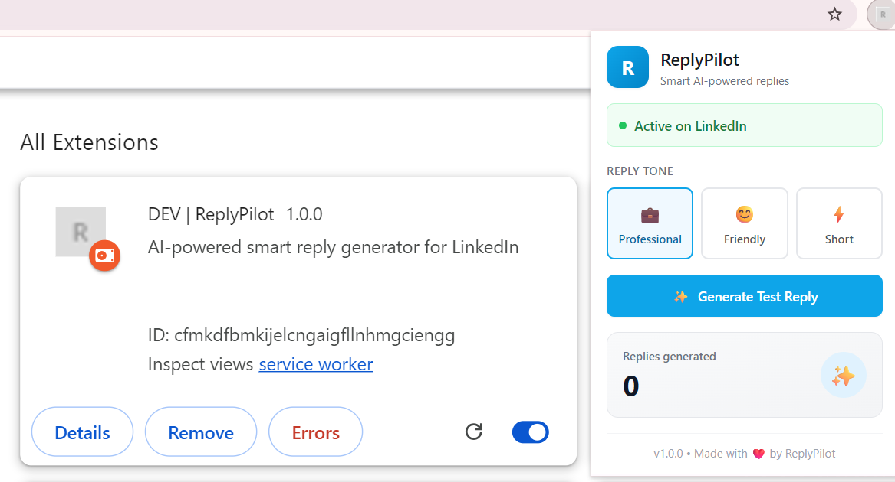
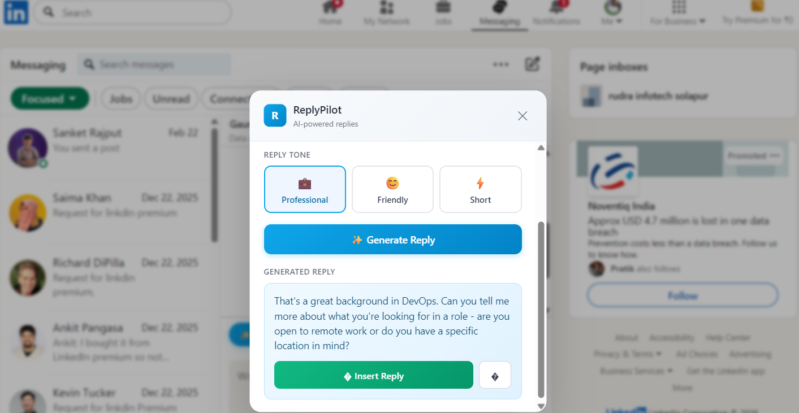
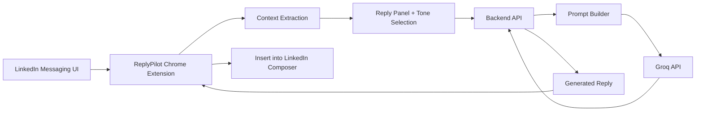
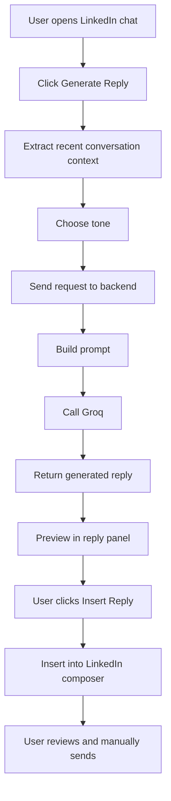

# ReplyPilot

> AI-powered Chrome extension for generating smart, context-aware LinkedIn replies with human review before send.


<p align="left">
  
  
  
  
  
  
  
  
</p>

## Overview

ReplyPilot is a product-focused Chrome extension that helps users respond faster and more thoughtfully inside LinkedIn messaging.

Instead of switching tabs, copying messages into another tool, and manually drafting replies, ReplyPilot works directly in the LinkedIn workflow:

- it extracts recent message context from the active conversation
- sends that context to a custom backend
- generates a reply using Groq
- lets the user choose a tone
- inserts the reply back into the LinkedIn composer
- keeps sending fully manual

The goal is simple: reduce reply friction without taking control away from the user.

## Key Features

- `AI reply generation` powered by a custom backend and Groq
- `LinkedIn context extraction` from the active message thread
- `Tone selection` with `professional`, `friendly`, and `short` modes
- `One-click insert` into the LinkedIn composer
- `Manual-send safety` so users always review before sending
- `Lightweight tracking` for core extension usage events

## Product Preview

### Banner


### Extension Popup


### LinkedIn Reply Panel


### Demo / Workflow


## Architecture

ReplyPilot is split into two main parts:

- a Chrome extension built with Plasmo + React that runs inside LinkedIn
- a lightweight Node/Express backend that formats prompts, calls the AI provider, and returns a generated reply

The extension handles UI, context extraction, and insertion. The backend handles reply generation logic and provider communication.



## Workflow

At a high level, the user flow looks like this:

1. Open a LinkedIn conversation.
2. Click `Generate Reply`.
3. ReplyPilot reads the recent conversation context.
4. The selected tone and message context are sent to the backend.
5. The backend builds a prompt and calls Groq.
6. A generated reply is returned to the extension.
7. The user reviews the draft and clicks `Insert Reply`.
8. The draft is inserted into the LinkedIn composer for manual sending.



## Tech Stack

### Extension / Frontend

- `Plasmo`
- `React`
- `TypeScript`
- `Tailwind CSS`
- `Chrome Extension Manifest V3`

### Backend

- `Node.js`
- `Express`
- `TypeScript`
- `ts-node`
- `nodemon`

### AI / Provider

- `Groq API` as the primary MVP provider
- `OpenAI API` support available as an alternative provider path

### Tracking / Analytics

- lightweight backend event tracking
- current MVP focuses on extension usage signals rather than a full analytics dashboard

## Folder Structure

```text
ReplyPilot/
├── backend/
│   ├── src/
│   │   ├── config/
│   │   ├── controllers/
│   │   ├── middleware/
│   │   ├── providers/
│   │   ├── routes/
│   │   ├── services/
│   │   ├── types/
│   │   ├── utils/
│   │   └── app.ts
│   ├── .env.example
│   ├── package.json
│   └── tsconfig.json
├── extension/
│   ├── assets/
│   ├── src/
│   │   ├── adapters/
│   │   ├── background/
│   │   ├── contents/
│   │   ├── lib/
│   │   ├── popup/
│   │   └── types/
│   ├── package.json
│   ├── tailwind.config.js
│   └── tsconfig.json
├── docs/
│   ├── banner.png
│   ├── popup-preview.png
│   ├── reply-panel.png
│   ├── reply-generation.gif
│   ├── architecture.png
│   └── workflow.png
├── README.md
└── SETUP.md
```

## Local Setup

### 1. Clone the repository

```bash
git clone https://github.com/your-username/replypilot.git
cd replypilot
```

### 2. Install backend dependencies

```bash
cd backend
npm install
```

### 3. Configure backend environment variables

Create a `.env` file inside `backend/` using `backend/.env.example` as a reference.

Example:

```env
PORT=3001
NODE_ENV=development
AI_PROVIDER=groq
GROQ_API_KEY=gsk_your-groq-api-key-here
OPENAI_API_KEY=sk-your-openai-api-key-here
```

### 4. Run the backend

```bash
cd backend
npm run dev
```

The API should start on `http://localhost:3001`.

### 5. Install extension dependencies

```bash
cd extension
npm install
```

If your local setup uses `pnpm`, you can also run:

```bash
pnpm install
```

### 6. Run the extension

```bash
cd extension
npm run dev
```

### 7. Load the extension in Chrome

1. Open `chrome://extensions`
2. Enable `Developer mode`
3. Click `Load unpacked`
4. Select the generated extension build folder from the Plasmo dev output

## Usage / Testing

To test ReplyPilot on LinkedIn:

1. Open LinkedIn messaging and enter an active conversation.
2. Click the `Generate Reply` button injected by the extension.
3. Review the extracted conversation context in the reply panel.
4. Choose a tone:
   - `professional`
   - `friendly`
   - `short`
5. Generate the reply.
6. Click `Insert Reply` to place it into the LinkedIn composer.
7. Review the draft and manually click `Send` yourself if it looks right.

## Safety

ReplyPilot is intentionally designed with a manual-send workflow.

- replies are `generated`, not auto-sent
- inserted drafts remain `editable`
- the user is expected to `review before sending`
- no automated outbound LinkedIn messaging is performed by the extension

## Current Status

### MVP Status

ReplyPilot is currently in `MVP` stage with a working end-to-end LinkedIn reply flow.

### Completed

- LinkedIn content script integration
- context extraction from message threads
- inline reply panel UX
- backend API for reply generation
- Groq-based AI reply generation
- tone selection
- draft insertion into the LinkedIn composer
- lightweight event tracking

### Planned Improvements

- stronger personalization
- smarter context cleanup and filtering
- more robust insertion reliability across LinkedIn UI variants
- production deployment for the backend
- packaged release flow

## Roadmap

- `Personalization`: smarter reply style adaptation per user preference
- `Context Quality`: better filtering of noisy or low-value thread text
- `AI Quality`: improved prompt tuning and safer, more natural replies
- `Deployment`: hosted backend environment for real-world usage
- `Chrome Web Store`: extension packaging and store submission
- `Analytics Dashboard`: a lightweight internal dashboard for product insights

## Author

Built by `Your Name`

- LinkedIn: `https://www.linkedin.com/in/your-linkedin/`
- GitHub: `https://github.com/your-github-username`

## License

This project is available under the `MIT License`.
